# AnimeZ

OpenHarmony开源看动漫应用。__数据均来源于网络，仅供学习交流!__


## 开发环境

- 一加6T OpenHarmony 3.2
- DevEco Studio 3.1 Beta1
- SDK API9 3.2.13.5


## 已实现
- 番剧列表、番剧搜索、番剧观看、番剧下载
- 视频下载列表、视频收藏、历史记录、搜索记录
- 支持AVPlayer、Video控件和IjkPlayer三种播放器（其中Video和IjkPlayer目前都不够完善，推荐使用AVPlayer）
- 支持M3u8视频离线缓存，支持离线观看M3u8视频
- 支持切换暗色模式


## 待实现
- 支持更多番剧数据源
- 搜索时支持同时搜索多个数据源
- 支持番剧分类、时间表等功能
- 视频播放支持投屏、小窗播放等功能
- 支持搜索下载列表、历史播放和收藏记录
- 手势切换视频进度、视频音量和屏幕亮度


## 截图预览

<div>
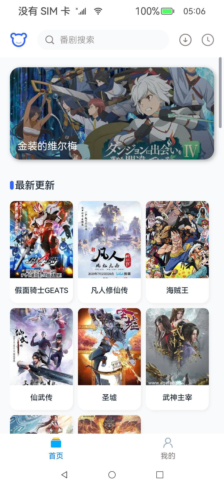

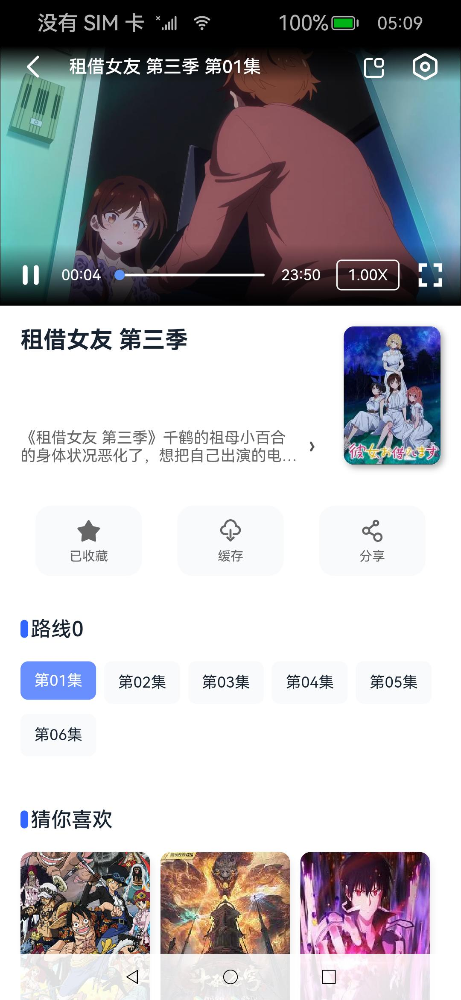
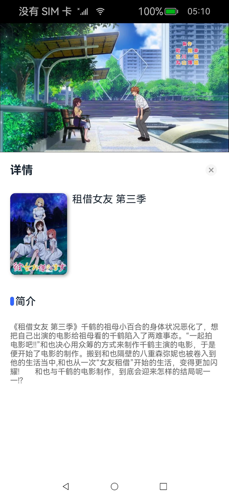

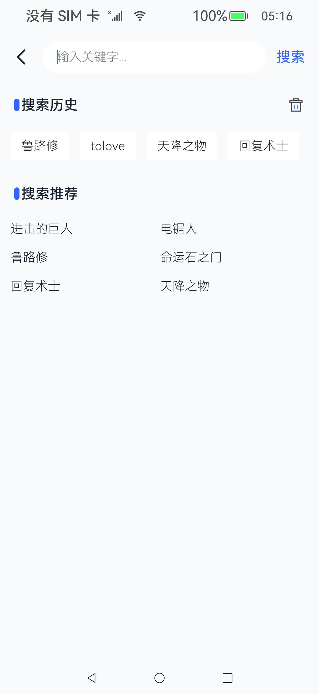
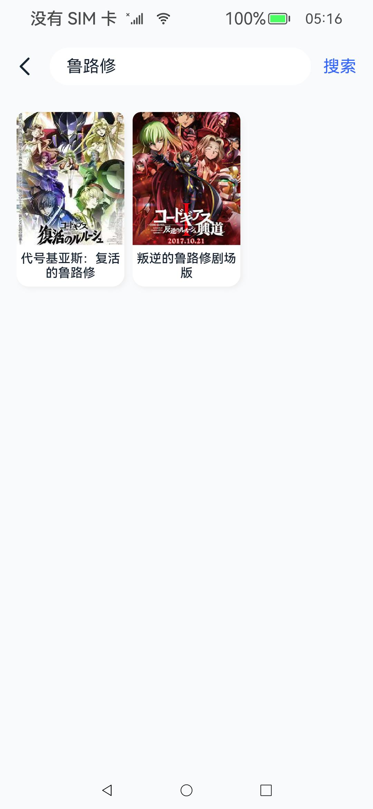
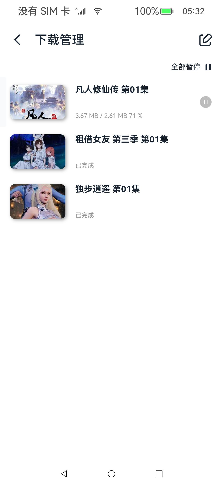


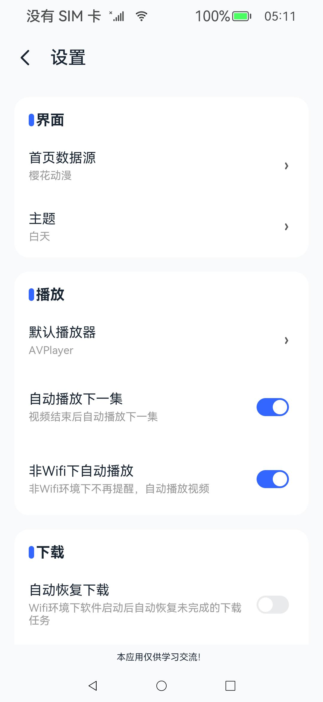

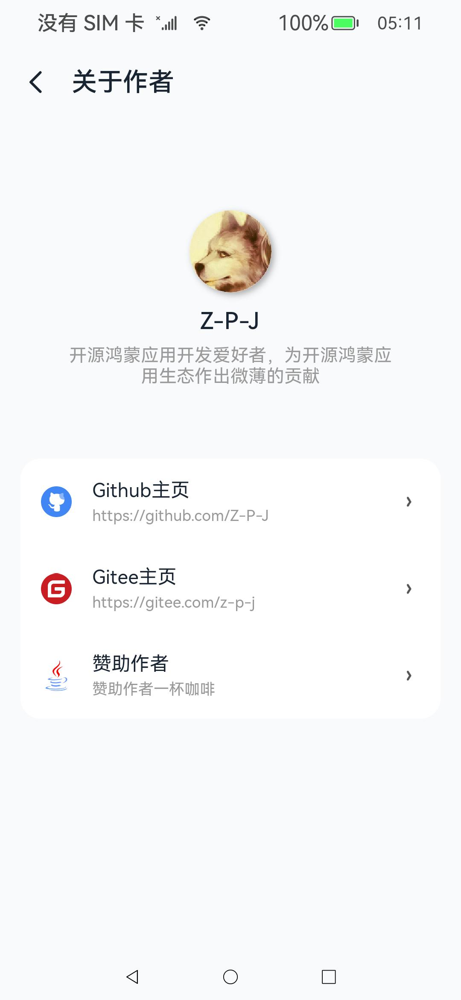
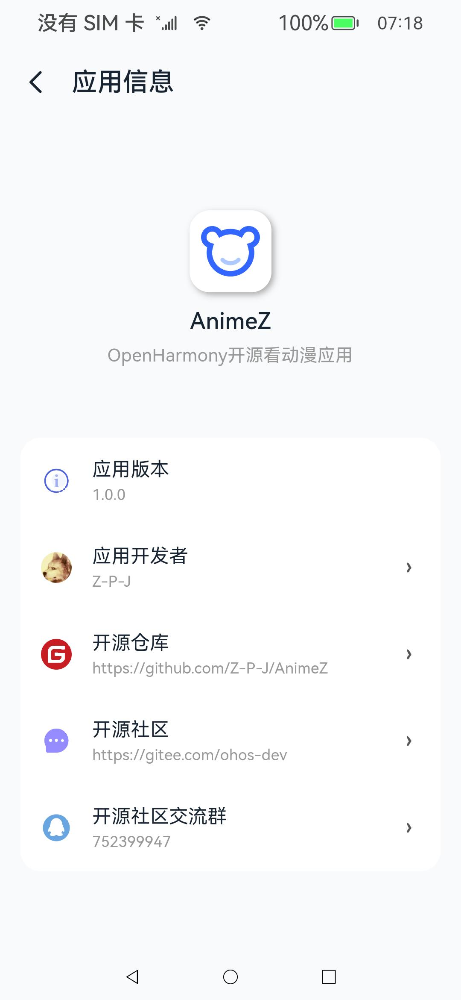
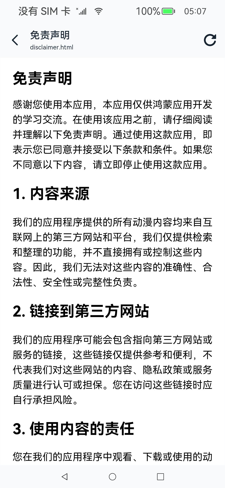
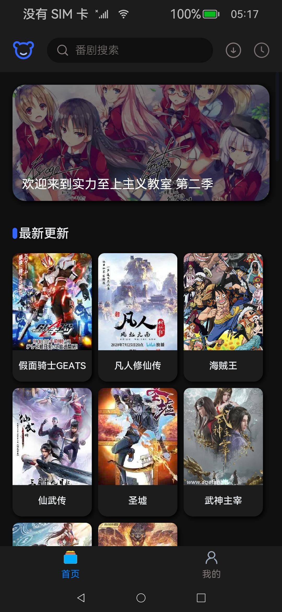
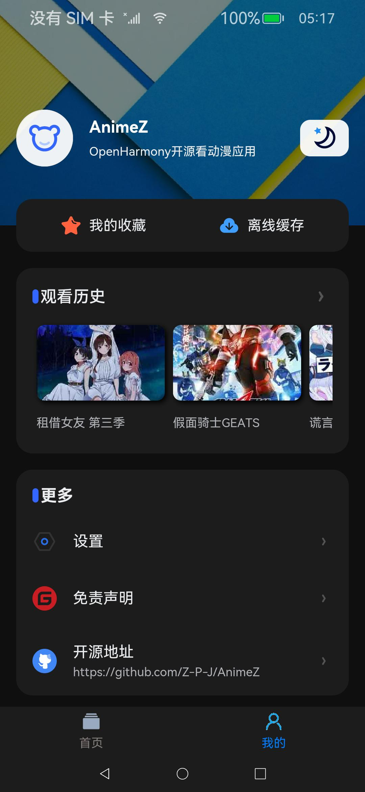
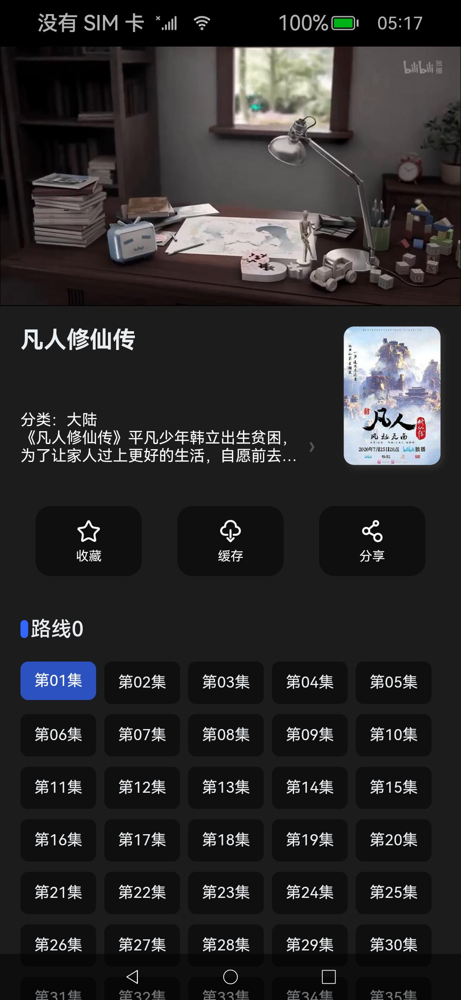
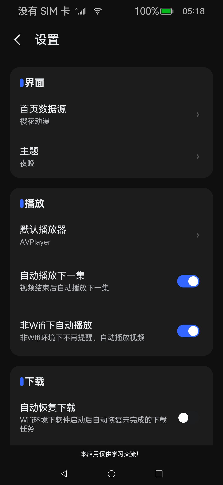
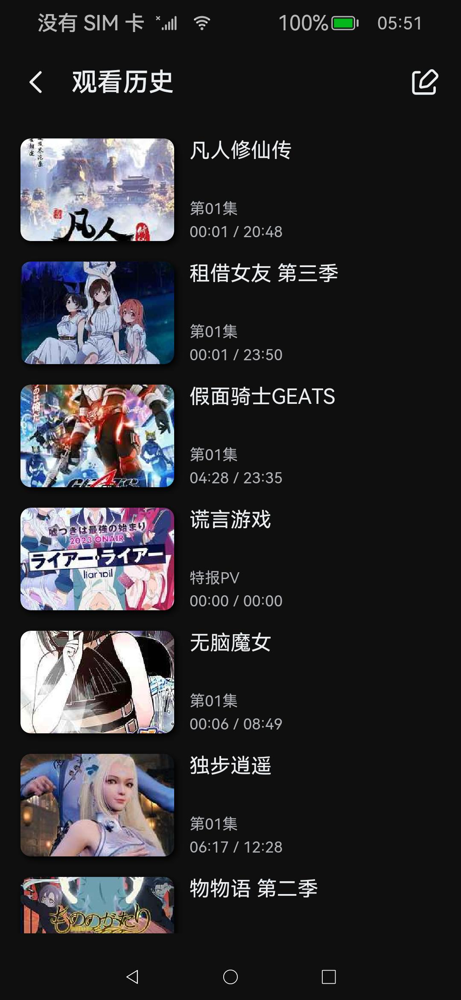
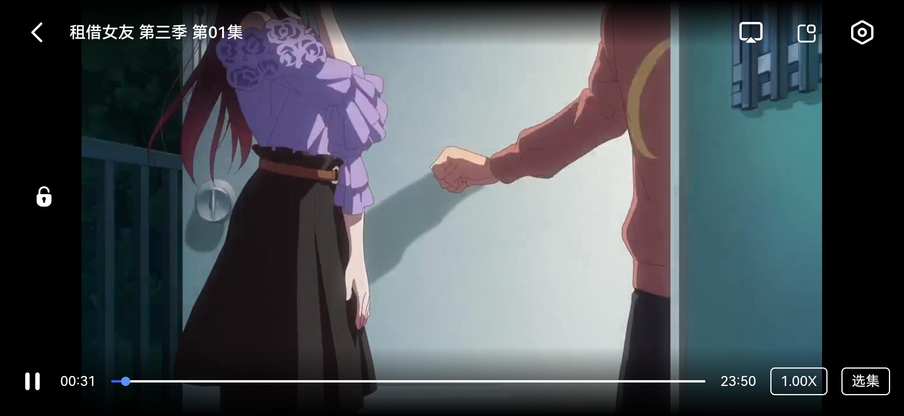

</div>


## 更新日志

- 2023/08/20
    - 初始提交


## License

```text
 
   Copyright 2023 Z-P-J

   Licensed under the Apache License, Version 2.0 (the "License");
   you may not use this file except in compliance with the License.
   You may obtain a copy of the License at

       http://www.apache.org/licenses/LICENSE-2.0

   Unless required by applicable law or agreed to in writing, software
   distributed under the License is distributed on an "AS IS" BASIS,
   WITHOUT WARRANTIES OR CONDITIONS OF ANY KIND, either express or implied.
   See the License for the specific language governing permissions and
   limitations under the License.

```